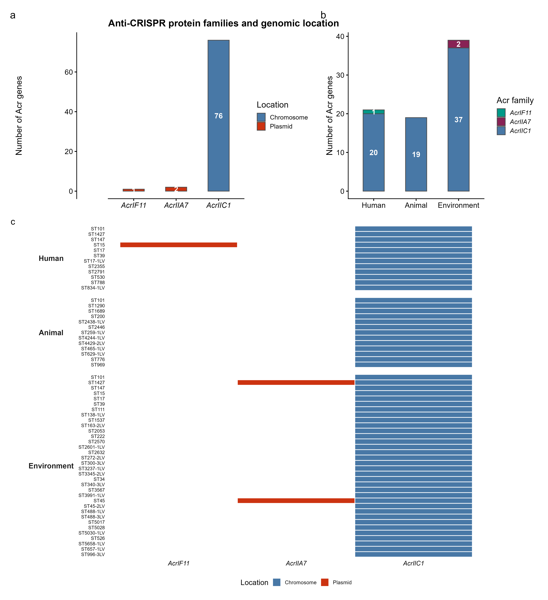

# Persistence-Resistance Plasmids in *Klebsiella pneumoniae* across One Health Compartments in Ghana

## Overview

Analysis code and computational pipeline for:

**"CRISPR immune failure enables cross-niche spread of persistence-resistance plasmids in *Klebsiella pneumoniae*"**

78 *K. pneumoniae* isolates from clinical (n=20), animal (n=21), and environmental (n=37) sources in Ghana. 370 plasmids, 152 clusters, 32 cross-niche.

## Repository Structure

```
kp_prp_analysis/
├── README.md
├── .gitignore
├── scripts/
│   ├── 01_genome_characterisation.sh    # Unicycler + Kleborate + BacPipe
│   ├── 02_plasmid_reconstruction.sh     # MOB-suite pipeline
│   ├── 03_crispr_analysis.sh            # CRISPRimmunity pipeline
│   ├── 04_abricate_annotation.sh        # ABRicate on plasmid FASTAs
│   ├── 05_blast_spacer_plasmid.sh       # Spacer vs plasmid BLAST
│   ├── 06_data_integration.R            # Data loading, merging, QC
│   ├── 07_analysis_all.R               # Resistome, plasmid sharing, GLM, PRP
│   ├── 08_acr_genomic_location.R        # Acr chromosomal vs plasmid mapping
│   └── 09_snp_analysis.sh              # Core SNP analysis for clonal validation
├── data/
│   ├── sample_metadata.csv
│   └── README_data.md
├── figures/
│   └── README_figures.md
└── docs/
    └── methods.md
```

## Pipeline Overview

### Bioinformatics (scripts 01-05)
1. Quality control, trimming, assembly (FastQC, Trimmomatic, Unicycler)
2. Species ID, MLST, AMR/virulence detection (Kleborate, BacPipe)
3. Plasmid reconstruction and typing (MOB-suite)
4. CRISPR-Cas, anti-CRISPR, spacer extraction (CRISPRimmunity)
5. Plasmid annotation (ABRicate: NCBI, VFDB, PlasmidFinder)
6. Spacer-plasmid matching (BLASTn blastn-short)
7. Core SNP analysis for clonal validation (Snippy)

### Statistical analysis (scripts 06-08)
- Data integration and cross-referencing across tools
- Resistome clustering (Jaccard, PCoA, PERMANOVA)
- Cross-niche plasmid sharing and Venn analysis
- GC deviation analysis
- Logistic regression (mobility, host range, GC deviation)
- CRISPR immune classification
- Spacer-plasmid targeting matrix (9 compartment combinations)
- Anti-CRISPR genomic location mapping
- PRP characterisation (AMR, virulence, IS content)

## Dependencies

### Bioinformatics
- Unicycler v0.4.9
- Kleborate v2.4.1
- BacPipe v1.2
- MOB-suite v3.1.4
- CRISPRimmunity v1.0
- ABRicate v1.0.1
- NCBI BLAST+ v2.14.0
- Snippy v4.6.0
- snp-dists v0.8.2

### R packages
- tidyverse v2.0.0, ggplot2 v4.0.3, patchwork v1.2.0
- gggenes v0.5.1, ggrepel v0.9.5, circlize v0.4.16
- vegan v2.6-4, VennDiagram v1.7.3, readxl v1.4.3

## Key Findings

1. 32 of 152 plasmid clusters (21%) cross One Health compartment boundaries
2. Non-mobilizable plasmids more likely cross-niche than conjugative (OR=0.653, p=0.007)
3. Zero functional CRISPR-Cas immunity across 78 isolates (77/78 carry anti-CRISPR)
4. 96.8% of anti-CRISPR genes chromosomal, not plasmid-borne
5. 2,639 spacer-plasmid matches across all compartment boundaries
6. PRPs: novel class combining AMR + biofilm + IS elements, lacking hypervirulence

## Data Availability

- Raw reads: NCBI SRA under BioProject [PRJNA_XXXXXX]
- Assembled genomes: [repository TBD]
- This repository: https://github.com/righteousagoha/kp-prp-one-health-ghana

## Citation

[To be added upon publication]

## License

MIT License

## Contact

Righteous Kwaku Agoha

## Key Figure: Anti-CRISPR Genomic Location



**Supplementary Figure: Anti-CRISPR protein families and genomic location.** (a) AcrIIC1 dominates (76/81 genes), with all copies chromosomally located. (b) Distribution by source compartment. (c) Per-ST tile showing that all cross-niche STs carry exclusively chromosomal AcrIIC1. Only 3 of 96 Acr genes are plasmid-borne, none on cross-niche PRPs.
